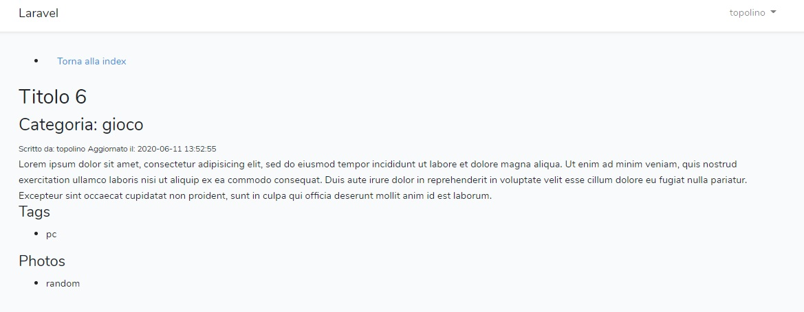

# Laravel-many-to-many
Laravel blog where a registered user can create a post, select its category and tags.   
Authentication has been used so that only the author of a post can modify or delete it.

Bootstrap, PHP, Laravel, MySQL.
***
### DB:

### Preview-index:  

### Preview-edit:  

### Preview-show:  

